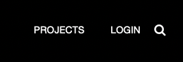
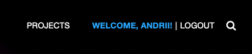
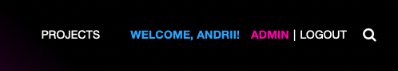
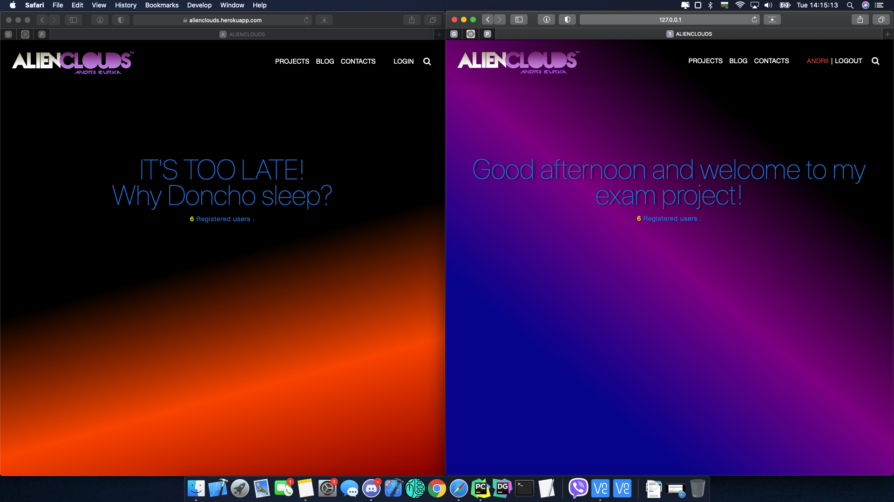
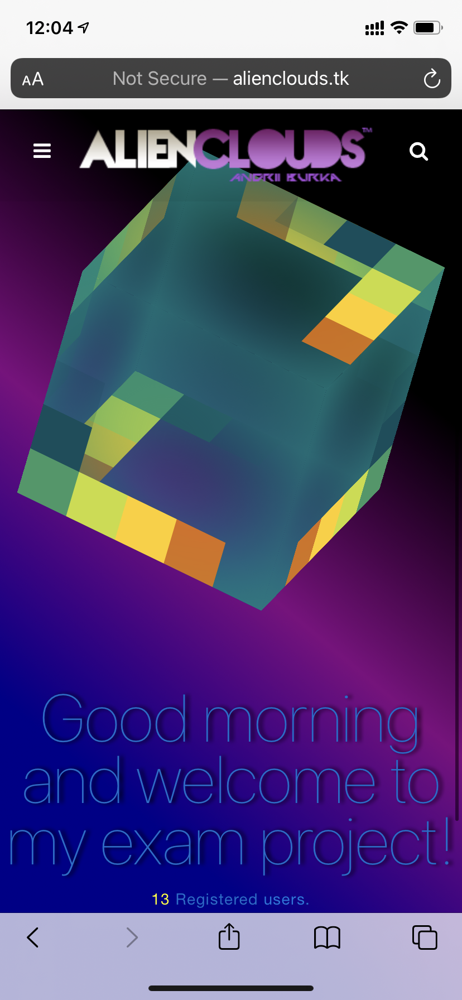

[![homepage][1]][2]

[1]:  static/img/readme_images/demo-day.png
[2]:  https://alienclouds.herokuapp.com "Heroku hosted AlienClouds App"

- [x] if not logged

- [x] if logged as user -> "Welcome, User!"

- [x] if logged as superuser -> "Welcome, Superuser! ..LinkToAdminPage"

- [x] shifting background (night (left), day (right))

- [x] responsive design

